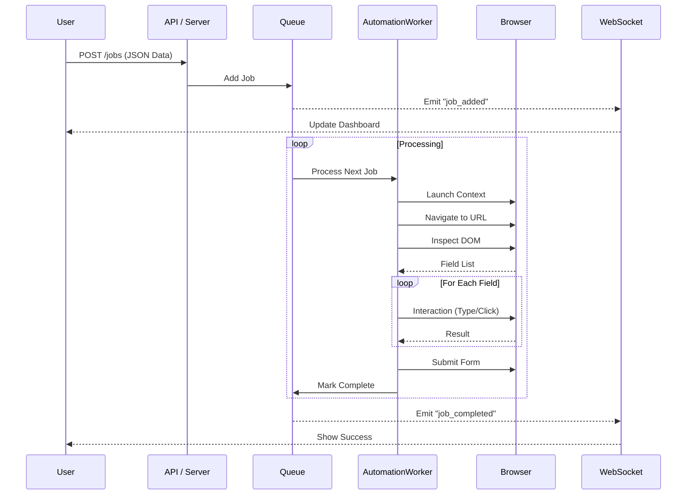

# Form Automation System - Architecture

## High-Level Overview

The Form Automation System is a distributed-style application (monolithic deployment) designed to handle web form automation tasks reliably. It separates the **Control Plane** (API/UI), the **Queueing Mechanism**, and the **Execution Plane** (Playwright Worker).

## System Components

### 1. Frontend Layer (`src/frontend`)
*   **Technologies**: HTML5, Vanilla JavaScript, CSS3.
*   **Purpose**: Provides a user interface to:
    *   Submit new automation jobs manually.
    *   View the real-time status of the job queue.
    *   Inspect detailed logs of executing jobs.
*   **Communication**: Connects to the backend via **WebSockets (`socket.io-client`)** for live updates and **HTTP REST** for job submission.

### 2. Backend Server (`src/backend`)
*   **Entry Point**: `server.js`
*   **Technologies**: Node.js, Express, Socket.io.
*   **Responsibilities**:
    *   Host the static frontend files.
    *   Expose REST API endpoints (`POST /jobs`, `GET /jobs`).
    *   Manage WebSocket connections for broadcasting events (`job_added`, `job_update`).
    *   Initialize the Job Queue.

### 3. Queue Management (`queue.js`)
*   **Structure**: In-memory FIFO (First-In-First-Out) queue.
*   **Concurrency**: STRICTLY SEQUENTIAL (Concurrency = 1).
    *   *Reasoning*: Browsers are resource-heavy; running multiple in parallel on a desktop environment can cause instability.
*   **State Management**: Tracks jobs through lifecycle: `PENDING` -> `IN_PROGRESS` -> `COMPLETED` / `FAILED`.

### 4. Automation Worker (`automationWorker.js`)
*   **Engine**: Microsoft Playwright.
*   **Function**: The "consumer" of the queue.
*   **Workflow**:
    1.  Launches a fresh Browser Context for isolation.
    2.  Navigates to the `formUrl`.
    3.  Injects the `FormInspector` script.
    4.  Iterates through fields needed vs. fields found.
    5.  Executes specific interaction logic (Type, Click, Select).
    6.  Submits the form and verifies success.

### 5. Form Inspector (`formInspector.js` & `fieldInteractions.js`)
*   **Execution Environment**: Runs *inside* the browser page context (DOM).
*   **Logic**:
    *   Traverses DOM to find inputs.
    *   Maps "Human Readable Labels" to "CSS Selectors".
    *   Handles platform-specific quirks (Google Forms' Shadow DOM or obscured inputs).

### 6. MCP Agent Layer (`src/backend/mcp`)
*   **Purpose**: Adds AI capabilities to the standard automation.
*   **Components**:
    *   `agent.js`: The "Brain" that communicates with LLMs (Claude).
    *   `tools.js`: Exposes browser primitives as AI tools (`navigate`, `read_page`, `fill_field`).
    *   `jobContext.js`: Maintains the "memory" of the reasoning process.

## Data Flow Diagram



## Directory Structure & Modules

```
src/
├── backend/
│   ├── server.js           # Express App & Socket.io setup
│   ├── queue.js            # Job Queue orchestration
│   ├── automationWorker.js # Playwright controller
│   ├── formInspector.js    # DOM analysis logic
│   └── mcp/                # Model Context Protocol (AI)
│       ├── agent.js
│       └── tools.js
├── frontend/
│   ├── app.js              # UI Logic
│   └── styles.css          # Styling
└── shared/
    └── fieldInteractions.js # Universal interaction logic
```
